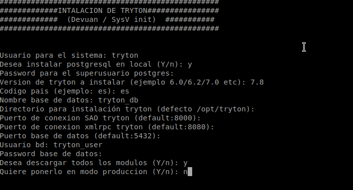
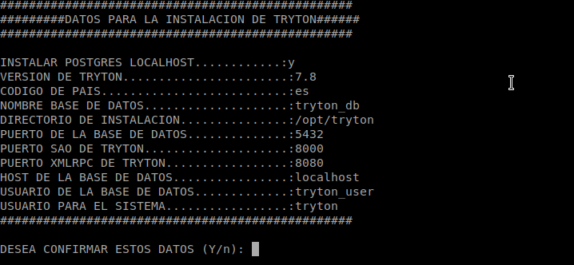

# Scripts de instalación de Tryton ERP


## Descripción

Scripts de instalación de Tryton ERP para varios sistemas operativos.
- **Debian / systemd**
- **Devuan / SysV init**
- **Freebsd**  Actualizado para la version 8.0 con ssl
  
Los scripts despliegan un servidor de Tryton ERP con su configuración lista para usar. Durante la ejecución, el script solicitará una serie de datos, como el usuario del sistema para Tryton ERP.

Existen dos modalidades de instalación:

- **Instalación local con PostgresSQL** No tiene que tener ya instalado Postgres, en este modo instala y configura automáticamente el servidor.
- **Solo instalación de Tryton ERP**: en esta modalidad, solo se configura la conexión con los datos introducidos a la base de datos PostgresQL (existente).

## Configuración de almacenamiento de archivos fuera de la base de datos

Si configuramos el parámetro filestore se habilita el almacenamiento en disco y no en la base de datos.
El parámetro store_prefix crea una subcarpeta dentro de storage_db/ donde almacenará los datos.
Cada módulo tiene sus configuraciones propias:
- **[attachment]**  
  El almacenamiento de todos los archivos adjuntos del sistema.

- **[account_invoice]**  
  Almacena archivos generados de facturación, como PDFs.

- **[account_statement]**  
  Guarda los archivos origen de los extractos bancarios (ej. ficheros importados).

- **[document_incoming]**  
  Almacena los documentos escaneados del módulo `document_incoming`.

- **[database]**  
  La ruta de almacenamiento se configura en path = directorio_instalacion/storage_db aquí especifica la ruta de almacenamiento general.
  Para la Configuración del almacenamiento de los avatares sería `avatar_prefix = avatar` y `avatar_filestore = True`.

En el archivo `tryton.cfg` para el almacenamiento:

```cfg
[database]
path = $directorio_instalacion/storage_db
avatar_filestore = False
avatar_prefix = avatar

[account_invoice]
# Almacenar adjuntos en disco (FileStore) en lugar de en la BD
filestore = False
# Prefijo de subdirectorio dentro del FileStore para los adjuntos
store_prefix = invoices

[account_statement]
# Almacenar adjuntos en disco (FileStore) en lugar de en la BD 
filestore = False
# Prefijo de subdirectorio dentro del FileStore para los adjuntos
store_prefix = account_statement

[document_incoming]
# Almacenar adjuntos en disco (FileStore) en lugar de en la BD 
filestore = False
# Prefijo de subdirectorio dentro del FileStore para los documentos del
#modulo document_incoming
store_prefix = document_incoming

[attachment]
# Almacenar adjuntos en disco (FileStore) en lugar de en la BD
filestore = False
# Prefijo de subdirectorio dentro del FileStore para los adjuntos
store_prefix = attachment
```


## Configuración de decimales

La configuración estándar es de **4 dígitos decimales** para los precios de los productos.

Hay que tener en cuenta que si crea la base de datos de tryton con 4 dígitos luego no se puede cambiar. Solo tiene que descomentar la línea price_decimal y establecer el valor.


```cfg
[product]
# The number of decimals with which the unit prices are stored
# in the database. The default value is 4.
# Warning: This setting can not be lowered once a database is created.
price_decimal = 4

```
# Estructura de archivos
```cfg
directorio_instalacion/
                      config/ # contiene los archivos de configuración como tryton.cfg y los de los logs
                      log/ # almacenamiento de los logs de TRYTON
                      sao/ #directorio que contiene el sao
                      storage_db/ # directorio para el almacenamiento en disco de los archivos binarios para no usar la base de datos

```
# Menú de instalación de Tryton ERP



